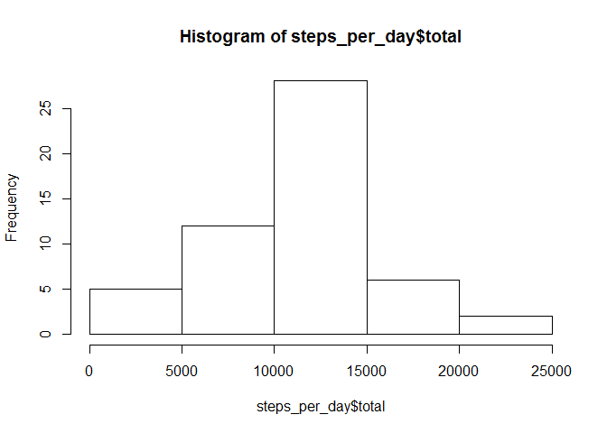
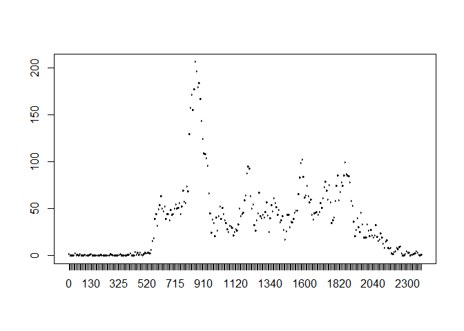

# Reproducible Research: Peer Assessment 1


## Loading and preprocessing the data


```r
library(dplyr)
```

```
## 
## Attaching package: 'dplyr'
## 
## The following object is masked from 'package:stats':
## 
##     filter
## 
## The following objects are masked from 'package:base':
## 
##     intersect, setdiff, setequal, union
```

```r
walk_data <- read.csv("activity.csv", stringsAsFactors = FALSE)
walk_table <- tbl_df(walk_data)
```

## What is mean total number of steps taken per day?


```r
steps_per_day <- walk_table %>%
    group_by(date) %>%
    summarize(total = sum(steps))
steps_per_day
```

```
## Source: local data frame [61 x 2]
## 
##          date total
## 1  2012-10-01    NA
## 2  2012-10-02   126
## 3  2012-10-03 11352
## 4  2012-10-04 12116
## 5  2012-10-05 13294
## 6  2012-10-06 15420
## 7  2012-10-07 11015
## 8  2012-10-08    NA
## 9  2012-10-09 12811
## 10 2012-10-10  9900
## ..        ...   ...
```

```r
y <- hist(steps_per_day$total)
```

 

```r
mean_med <- summarize(steps_per_day, mean_steps = mean(total, na.rm = TRUE), median_steps = median(total, na.rm = TRUE))
mean_med
```

```
## Source: local data frame [1 x 2]
## 
##   mean_steps median_steps
## 1   10766.19        10765
```

## What is the average daily activity pattern?


```r
walk_table$interval <- as.factor(walk_table$interval)
steps_per_interval <- aggregate(walk_table$steps, by = list(interval = walk_table$interval), FUN=mean, na.rm=TRUE)
plot(steps_per_interval$interval, steps_per_interval$x)
```

 

```r
steps_per_interval$interval <- as.integer(levels(steps_per_interval$interval)[steps_per_interval$interval])
colnames(steps_per_interval) <- c("interval", "steps")
max_interval <- steps_per_interval[which.max(steps_per_interval$steps),]
max_interval
```

```
##     interval    steps
## 104      835 206.1698
```

## Imputing missing values


```r
l <- sum(is.na(walk_table$steps))
l
```

```
## [1] 2304
```

We will replace missing values with the median of steps per day divided by the number of intervals in a day to keep the median as close as possible to its current value.


```r
steps_per_date <- walk_table %>%
    group_by(date) %>%
    summarize(total = sum(steps))
z <- summarize(steps_per_date, mean_steps = mean(total, na.rm = TRUE), median_steps = median(total, na.rm = TRUE))
walk_table[is.na(walk_table)] <- (as.numeric(z[1, 2]) / 288)
walk_table
```

```
## Source: local data frame [17,568 x 3]
## 
##       steps       date interval
## 1  37.37847 2012-10-01        0
## 2  37.37847 2012-10-01        5
## 3  37.37847 2012-10-01       10
## 4  37.37847 2012-10-01       15
## 5  37.37847 2012-10-01       20
## 6  37.37847 2012-10-01       25
## 7  37.37847 2012-10-01       30
## 8  37.37847 2012-10-01       35
## 9  37.37847 2012-10-01       40
## 10 37.37847 2012-10-01       45
## ..      ...        ...      ...
```

```r
steps_per_date <- walk_table %>%
    group_by(date) %>%
    summarize(total = sum(steps))
steps_per_date_no.na <- steps_per_date[complete.cases(steps_per_date),]
y <- hist(steps_per_date_no.na$total)
```

 

```r
z <- summarize(steps_per_date_no.na, mean_steps = mean(total), median_steps = median(total))
z
```

```
## Source: local data frame [1 x 2]
## 
##   mean_steps median_steps
## 1   10766.03        10765
```

## Are there differences in activity patterns between weekdays and weekends?


```r
rm(list = ls())

library(dplyr)
walk_data <- read.csv("activity.csv", stringsAsFactors = FALSE)
walk_table <- tbl_df(walk_data)

j <- mutate(walk_table, day = weekdays(as.Date(as.character(date))))
Week <- c("Saturday", "Sunday")
for(i in 1:length(j$date)){
    if(is.element(j[i, 4], Week)){
        j[i, 4] <- "weekend"
    } else {
        j[i, 4] <- "weekday"
    }
} 
j
```

```
## Source: local data frame [17,568 x 4]
## 
##    steps       date interval     day
## 1     NA 2012-10-01        0 weekday
## 2     NA 2012-10-01        5 weekday
## 3     NA 2012-10-01       10 weekday
## 4     NA 2012-10-01       15 weekday
## 5     NA 2012-10-01       20 weekday
## 6     NA 2012-10-01       25 weekday
## 7     NA 2012-10-01       30 weekday
## 8     NA 2012-10-01       35 weekday
## 9     NA 2012-10-01       40 weekday
## 10    NA 2012-10-01       45 weekday
## ..   ...        ...      ...     ...
```


